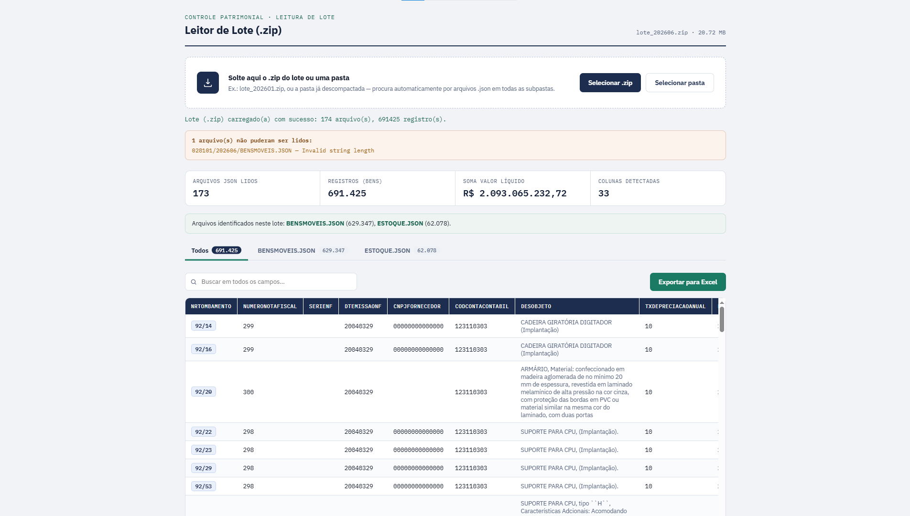

# 📊 Leitor de Prestação de Contas Patrimoniais

## 📸 Demonstração



Aplicação web desenvolvida para leitura, consolidação e análise de arquivos de prestação de contas patrimoniais das Secretarias do Estado do Amazonas.

A solução foi criada para simplificar a conferência de informações patrimoniais, permitindo a leitura em lote de arquivos JSON, provenientes de prestações de contas de bens móveis, estoque e imóveis. A aplicação realiza a consolidação automática dos dados, apresenta estatísticas operacionais, permite pesquisas rápidas e exporta os resultados para planilhas Excel. 【1-80573a】

---

## 🎯 Objetivo

Os processos de prestação de contas patrimoniais frequentemente geram grandes volumes de arquivos JSON distribuídos em múltiplas pastas e subpastas. A análise manual desses arquivos pode ser demorada e sujeita a inconsistências.

Este projeto automatiza a leitura e organização dessas informações, permitindo uma análise mais rápida, eficiente e confiável dos dados patrimoniais. 【1-80573a】

---

## 🚀 Funcionalidades

- Leitura de arquivos compactados (.zip)
- Leitura direta de pastas e subpastas
- Identificação automática de arquivos JSON
- Consolidação de registros em lote
- Separação automática por tipo de arquivo
- Filtros e pesquisa em todos os campos
- Estatísticas dos dados carregados
- Paginação para grandes volumes de registros
- Exportação para Excel (.xlsx)
- Interface responsiva para análise operacional 【1-80573a】

---

## 🏢 Casos de Uso

A ferramenta pode ser utilizada para análise e validação de arquivos relacionados a:

- Bens móveis
- Estoque de materiais
- Imóveis
- Inventários patrimoniais
- Prestação de contas patrimoniais
- Conferência de dados para auditorias
- Validação de informações antes da consolidação dos relatórios

---

## 🛠 Tecnologias Utilizadas

- HTML5
- CSS3
- JavaScript (Vanilla JS)
- JSZip
- SheetJS (XLSX)

---

## 📂 Estrutura dos Dados

A aplicação foi desenvolvida para processar lotes contendo arquivos JSON organizados em pastas ou dentro de arquivos ZIP.

Exemplo:

```text
PrestacaoContas.zip
├── bens_moveis.json
├── estoque.json
├── imoveis.json
└── relatorios/
    ├── arquivo01.json
    └── arquivo02.json
```

---

## 📈 Benefícios

- Redução do tempo de análise de dados patrimoniais
- Melhoria na confiabilidade da conferência das informações
- Consolidação automática de registros
- Facilidade na exportação dos dados para Excel
- Agilidade em processos de auditoria e prestação de contas
- Aumento da produtividade operacional

---

## 💻 Como Utilizar

1. Clone o repositório:

```bash
git clone https://github.com/SEU-USUARIO/leitor-prestacao-contas-patrimoniais.git
```

2. Acesse o diretório do projeto:

```bash
cd leitor-prestacao-contas-patrimoniais
```

3. Abra o arquivo `index.html` em um navegador moderno.

4. Selecione um arquivo ZIP ou uma pasta contendo arquivos JSON.

5. Visualize os dados processados, utilize os filtros de pesquisa e exporte para Excel quando necessário.

---

## 🔍 Recursos Disponíveis

### Importação

- Arquivos ZIP
- Pastas locais
- Subpastas
- Múltiplos arquivos JSON

### Análise

- Visualização tabular
- Pesquisa em todos os campos
- Estatísticas automáticas
- Navegação por páginas
- Organização por categoria de arquivo

### Exportação

- Geração automática de planilhas Excel
- Criação de abas separadas por categoria
- Consolidação completa dos dados processados

---

## 👨‍💻 Autor

**João Victor Bastos Sena**

Desenvolvedor de soluções para automação de processos, análise de dados e gestão patrimonial no setor público.

---

## ⭐ Destaque

Este projeto demonstra competências em:

- Desenvolvimento Front-End
- Manipulação de arquivos JSON
- Processamento de dados em lote
- Geração de planilhas Excel
- Automação de processos administrativos
- Criação de ferramentas para apoio à gestão patrimonial pública

